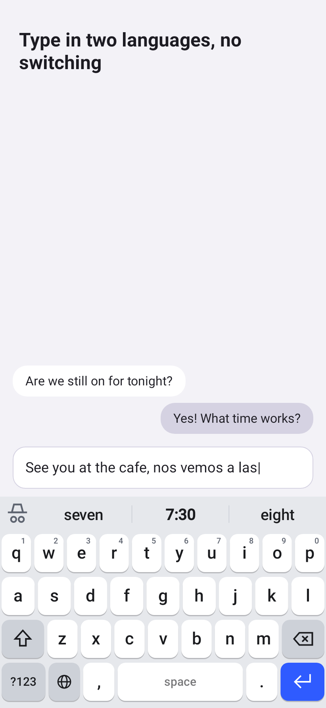
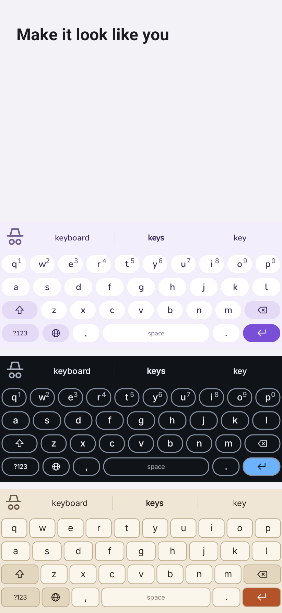
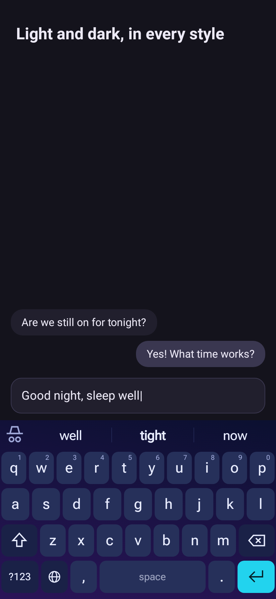
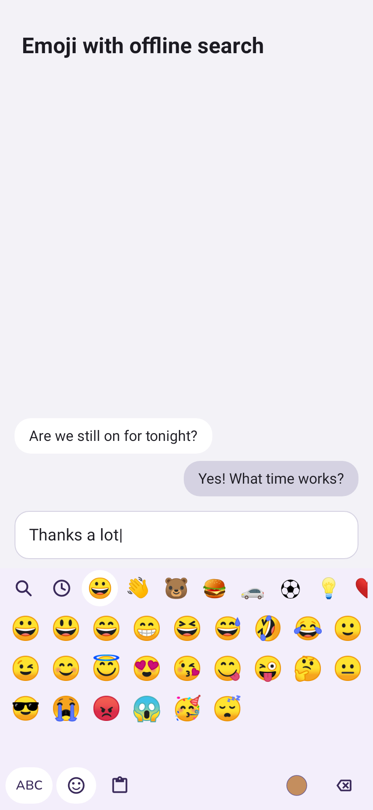
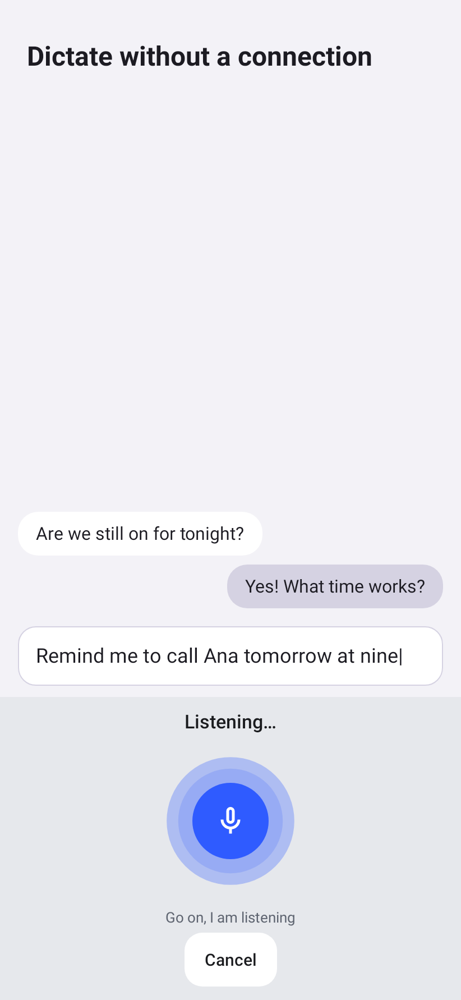

<!--
SPDX-FileCopyrightText: 2026 UltimateKeys contributors
SPDX-License-Identifier: GPL-3.0-or-later
-->

# UltimateKeys

A modern Android keyboard that is private, fully offline and looks the way you want. Written from scratch in Kotlin, with offline voice dictation.

> Status: pre-1.0 (0.x). The keyboard, styles, private mode, clipboard, emoji, gesture typing and dictation core work today. Screen reader support, the complete Spanish translation and the open-source licenses screen are in. See [CHANGELOG.md](CHANGELOG.md) for what each version has.

<p align="center">
  
  
  
  
  
</p>

## Features

Available today (see the changelog for the version that introduced each one):

- **Typing**: Spanish and English QWERTY (with `ñ`), two symbol pages, numeric and phone layouts, an optional number row, long-press accents and alternatives, shift and caps lock, auto-capitalization, double space for a period, an accelerating delete key, cursor control on the space bar and drag-to-select on delete.
- **Suggestions in two languages**: up to three suggestions, auto-correction (backspace right after undoes it) and next-word prediction, mixing Spanish and English with no switching. Your own dictionary can be imported and exported.
- **Gesture typing**: glide over the letters; the best word is typed, the alternatives wait in the suggestion bar.
- **Style engine**: see below.
- **Private mode**: starts by itself in incognito tabs and password fields, or by hand. While it is on nothing is learned and nothing is stored in the clipboard history.
- **Clipboard history**: keep clips for an hour, a day, a week or forever, with pin, delete and clear all. Items that apps flag as sensitive are never stored.
- **Emoji**: categories, recents, skin tones and offline search by name in English and Spanish.
- **Offline dictation**: a microphone key opens a voice panel; speech is recognized on the device by whisper.cpp in Spanish or English, with sound kept in memory only. The Whisper model is bundled (`full`), downloaded (`lite`) or imported from a file, and chosen in the model manager.

Coming before 1.0: checks on real devices and final polish (see docs/ACCEPTANCE.md and docs/HUMAN_VERIFICATION.md).

## Style engine

Every visual aspect of the keyboard is a parameter of a **style**: key corner radius, gaps, per-row heights, borders, shadows, fonts, key colors by class (letter, function, space, action), gradients and Material You colors, key popups and press feedback, the suggestion bar layout, the bottom-row arrangement and microphone placement, panel colors and corners, and panel motion. Each style has a light and a dark variant that follow the system or are forced.

- Nine built-in styles: Ultimate, Soft, Flat, Outline, Classic, Midnight, Paper, Dracula (the open Dracula palette) and OLED (pure black). Midnight, Dracula and OLED are always dark.
- An editor with a live preview, reset to the preset, duplicate, and a warning when text contrast is below WCAG AA.
- Styles are plain JSON files (`.ukstyle`): export, import (validated and clamped) and share them.
- Changes apply at once, without restarting the keyboard.

## Flavors

| Flavor | Whisper model | Network permission |
|---|---|---|
| `full` | `base`, bundled in the APK, copied to app storage on first run | none: it is not even declared, and the build fails if it appears |
| `lite` | downloaded from a pinned URL and verified by SHA-256, or imported from a file; a model manager lets you choose, delete and import | only for the model downloader |

Both share the package id `com.qtekfun.ultimatekeys`, the version code and the signing key, so one can be replaced by the other.

## Privacy

- No analytics, crash reporters, ads, accounts or cloud, in any build.
- The `full` flavor has no `INTERNET` permission; CI checks the merged manifest (`verifyFullHasNoInternet`).
- The `lite` flavor uses the network only to download a speech model that you ask for.
- Audio from dictation lives in memory only; nothing is written to disk.
- In private mode nothing is learned (typing, gestures or dictation) and nothing is stored in the clipboard history. Clear everything the keyboard learned at any time from the settings.

## Install

### GitHub releases

Download `UltimateKeys-<version>-full.apk` or `-lite.apk` and `SHA256SUMS.txt` from the [releases page](https://github.com/qtekfun/UltimateKeys/releases) and check the file before installing:

```sh
sha256sum --ignore-missing -c SHA256SUMS.txt
```

You can also check the signing certificate with `apksigner verify --print-certs UltimateKeys-<version>-lite.apk`; its SHA-256 digest must be:

```
59989c4961dc6f7b8c7534491180640416af454b2c0860e490fbc31d7fac98bd
```

Then enable UltimateKeys in the system keyboard settings and select it; the app has a setup screen that guides you.

### Obtainium

Add `https://github.com/qtekfun/UltimateKeys` as the source. Because every release has two APKs, set the APK filter to `lite` or `full` (a regular expression such as `-lite\.apk$`) so updates keep following the same flavor. Release candidates are marked as pre-releases and are skipped unless you opt in.

### F-Droid

Not available yet. The metadata is ready in [`fdroid/`](fdroid/com.qtekfun.ultimatekeys.yml) and the submission to F-Droid is pending. Only the `lite` flavor is planned for F-Droid; see [docs/DISTRIBUTION.md](docs/DISTRIBUTION.md). Builds are meant to be reproducible, so the F-Droid and GitHub APKs are the same file and you can update from either.

## Build

JDK 21 and the Android SDK (with the NDK and CMake pinned in `build-logic`) are required. The first build downloads the word lists and emoji data from pinned sources and verifies their SHA-256; after that they are cached and nothing is downloaded.

```sh
git clone --recurse-submodules https://github.com/qtekfun/UltimateKeys
cd UltimateKeys
./gradlew spotlessApply check assembleFullDebug assembleLiteDebug
```

`check` runs unit tests, lint, detekt, coverage verification, the screenshot tests, `verifyFullHasNoInternet` and `originalityCheck`. Release builds are unsigned unless the `UK_*` signing variables are set. Releases are made by pushing a version tag; see [RELEASING.md](RELEASING.md).

Store screenshots are rendered by the screenshot tests: `./gradlew :screenshots:updateStoreScreenshots` rewrites the images in `fastlane/metadata/android/*/images/phoneScreenshots/`.

## Contributing

Issues and pull requests are welcome: see [CONTRIBUTING.md](CONTRIBUTING.md). Code, comments, commits and docs are in English (Spanish is a UI translation). The product specification is in [SPEC.md](SPEC.md) and the roadmap in [PLAN.md](PLAN.md); report security problems as described in [SECURITY.md](SECURITY.md).

## Credits

UltimateKeys is original Kotlin code that builds on these projects, each under its own license:

- The suggestion engine of the **Android Open Source Project** (LatinIME native code and the Spanish and English word lists), Apache-2.0, vendored under `third_party/aosp-latinime/` with its notice and a list of modifications.
- **whisper.cpp** and ggml by Georgi Gerganov and contributors, MIT, as a git submodule in `third_party/whisper.cpp`; the speech models are OpenAI Whisper weights.
- **Unicode CLDR** annotations and the Unicode emoji data, Unicode License v3, for emoji search.
- Open fonts (Inter, Roboto Flex, Atkinson Hyperlegible, Nunito; SIL OFL 1.1) and Material Symbols (Apache-2.0).
- The papers behind gesture typing (SHARK2 and related work) are cited in `docs/THIRD_PARTY.md`.

Full details, pinned versions and checksums are in [docs/THIRD_PARTY.md](docs/THIRD_PARTY.md). UltimateKeys is part of the Ultimate family with [UltimateDeck](https://github.com/qtekfun/UltimateDeck).

## License

GPL-3.0-or-later; see [LICENSE](LICENSE). Third-party components keep their own licenses.
